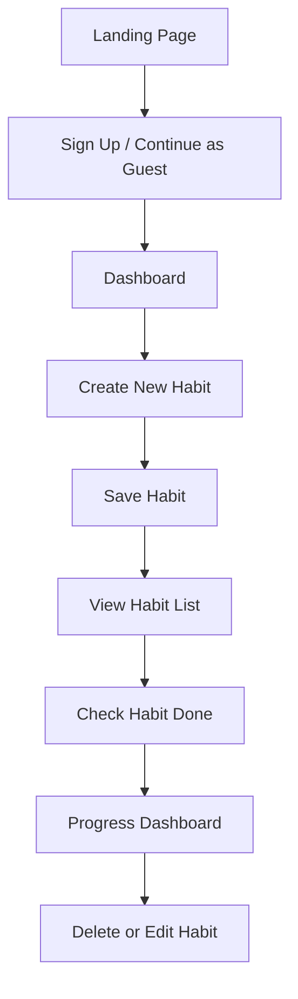

# 🧠 Product Requirements Document (PRD)
## Product Name: Habitflow

---

## 1. Overview

**Habitflow** is a lightweight web application designed to help users **create, track, and delete habits** with a clean, distraction-free interface. The app focuses on **simplicity, consistency, and motivation**, making habit-building approachable for everyday users who want clarity without the clutter of social feeds or gamified noise.

**Goal:**  
Empower users to build lasting habits by giving them a smooth flow — from idea → action → reflection — in a visually calming experience.

**Version:** 1.0 (MVP Web App)  
**Platform:** Responsive Web App (desktop + mobile web)  
**Owner:** Product Team / Solo Founder  
**Last Updated:** November 2025  

---

## 2. Objectives

| Objective | Success Metric |
|------------|----------------|
| Enable users to create habits in under 10 seconds | Avg. time-to-create < 10s |
| Daily tracking of habits with minimal friction | 70% of active users log ≥1 habit per day |
| Encourage retention through progress feedback | 40% weekly retention |
| Provide basic analytics dashboard | User can view streaks and completion % |

---

## 3. Target Users

**Primary Users:**  
- Individuals wanting to build or break personal habits (students, professionals, parents)  
- People frustrated by cluttered or overly gamified habit trackers  

**User Needs:**  
- Fast and intuitive habit creation  
- Simple daily check-in system  
- Visual motivation (streaks, stats)  
- Easy modification and deletion of habits  

---

## 4. Core Features (MVP Scope)

### 4.1 Habit Management
**Description:**  
Users can add, edit, or delete habits easily. Each habit has a name, optional category (e.g., Health, Learning), frequency (daily/weekly/custom), and reminder toggle.

**Requirements:**
- [ ] Create habit: title, frequency, category, emoji/icon  
- [ ] Edit habit name, frequency, and category  
- [ ] Delete habit (with confirmation modal)  
- [ ] Toggle completion for the current day  

---

### 4.2 Progress Tracking
**Description:**  
Show users a simple visual overview of their progress — streaks, completions, and trends.

**Requirements:**
- [ ] Calendar view for daily completions  
- [ ] Streak counter and longest streak metric  
- [ ] Completion percentage per habit  
- [ ] Optional “reset streak” button for transparency  

---

### 4.3 Dashboard / Home Screen
**Description:**  
Central hub showing all active habits and their current-day state.

**Requirements:**
- [ ] List view of all habits with quick “check” button  
- [ ] Filter by category or frequency  
- [ ] Simple “Today’s Progress” summary bar  
- [ ] Visual theme with minimal distraction (calming colors, whitespace)  

---

### 4.4 Notifications / Reminders (Stretch Goal)
**Description:**  
Optional web notifications to remind users to log habits.

**Requirements:**
- [ ] Local browser notifications  
- [ ] Time-based reminders (user-defined)  

---

### 4.5 User Accounts & Persistence
**Description:**  
Data persistence for habits and progress, either via local storage (MVP) or simple backend (stretch).

**Requirements:**
- [ ] LocalStorage persistence for MVP  
- [ ] Basic auth (email/password) in v1.1  
- [ ] Sync habits and progress to backend (if extended)  

---

## 5. Non-Functional Requirements

| Category | Requirement |
|-----------|--------------|
| **Performance** | App loads in < 2s on average network |
| **Accessibility** | Support keyboard navigation + high contrast mode |
| **Scalability** | Should support 10k concurrent users (for hosted version) |
| **Security** | If user accounts are implemented, use salted password hashing and HTTPS only |
| **Privacy** | No data sharing or analytics tracking without consent |

---

## 6. Design Guidelines

- **Aesthetic:** Calm, minimal, “flow” aesthetic (soft blue, pastel gradient)
- **UI Layout:**  
  - Left sidebar → categories / filters  
  - Main panel → daily habits list  
  - Top bar → progress summary + profile/settings  
- **Typography:** Clean sans-serif (Inter or Nunito)
- **UX Principle:** *One-tap actions, zero clutter*

---

## 7. Tech Stack (Proposed)

| Layer | Technology |
|--------|-------------|
| **Frontend** | React (Vite or Next.js), TailwindCSS |
| **Backend (optional)** | Node.js (Express) + SQLite / Supabase |
| **Auth (optional)** | Clerk / Firebase Auth |
| **Storage (MVP)** | LocalStorage or IndexedDB |
| **Hosting** | Vercel / Netlify |

---

## 8. User Flow

---

## 9. Future Enhancements

- Social sharing (habit groups or friend challenges)
- AI habit suggestion engine (“Try adding a sleep goal based on your current pattern”)
- Integration with wearable devices (Apple Health / Fitbit)
- Export data as CSV or Markdown for journaling
- Dark mode + motivational quote widget

---

## 10. Risks & Mitigation

| Risk | Mitigation |
|-------|-------------|
| Users forget to log habits | Add optional daily reminders |
| Feature creep | Lock MVP scope to create, track, delete |
| Low engagement after setup | Introduce minimal progress feedback + streaks |
| Data loss (if local storage) | Offer simple “export JSON” backup option |

---

## 11. Success Criteria (MVP)

- ✅ Users can create, track, and delete habits  
- ✅ Data persists after browser refresh  
- ✅ Simple, pleasant interface  
- ✅ Usability tested with at least 5 users  
